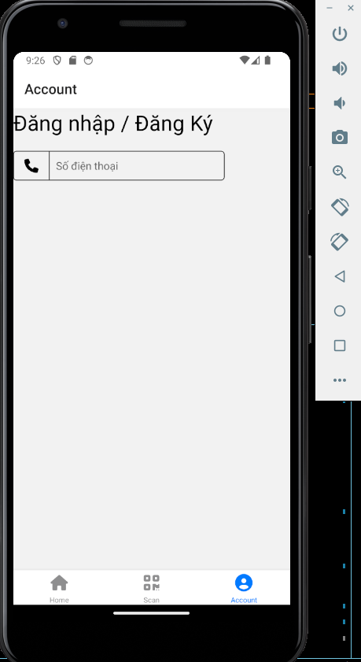
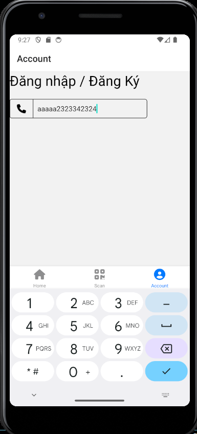
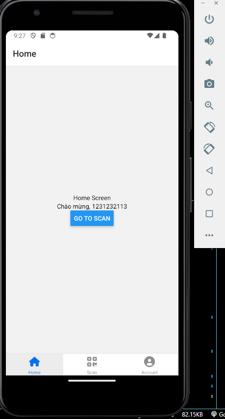
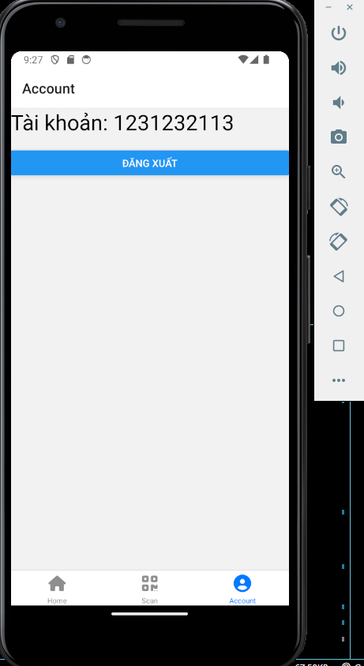

# Giới thiệu
- Bài tập 4 + 5 react-native

# Lưu ý
- Sau khi `git clone` thì phải cài hết package `npm i`

# Bài tập

## Bài tập 4
- Thành phần 
    - [NewTxtIpt.js](./components/NewTxtIpt.js)
    - [AccountScreen.js](./app/tab/AccountScreen.js)

- Màn hình đăng nhập  
    
- Màn hình đăng nhập khi nhập giá trị sai  
    
- Màn hình trang chủ khi đăng nhập thành công  
    
- Màn hình trang Account khi đăng nhập thành công  
    

# Bài tập 5